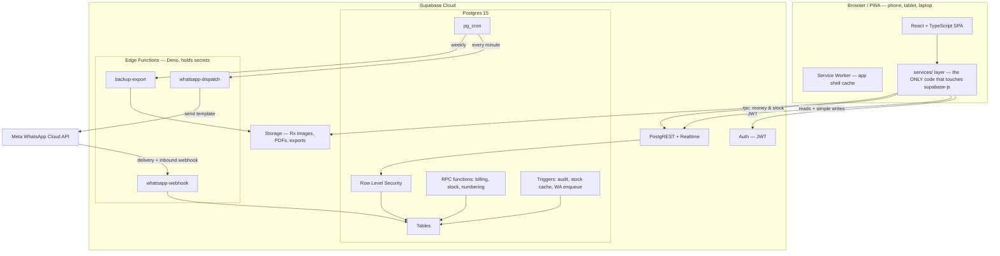
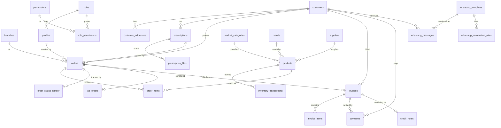
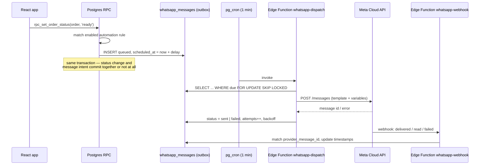

# Perfect Optical Vision — System Architecture

**Version:** 1.0 (design)
**Date:** 18 Aug 2026
**Status:** Awaiting sign-off before implementation begins

---

## 0. Summary of the recommendation

| Layer | Choice |
|---|---|
| Frontend | React 18 + TypeScript + Vite, Tailwind CSS, TanStack Query, react-hook-form + Zod |
| PWA | `vite-plugin-pwa` (Workbox) — installable, offline app shell |
| Database | Supabase Postgres 15 (managed) |
| Auth | Supabase Auth (email + password), `profiles` table, table-driven RBAC |
| Authorization | Postgres Row Level Security on **every** table |
| Business logic | Postgres functions (`plpgsql`, `SECURITY DEFINER`) for anything money/stock/atomic |
| Background + secrets | Supabase Edge Functions (Deno) + `pg_cron` + `pg_net` |
| Files | Supabase Storage (prescription images, invoice PDFs, logo, exports) |
| WhatsApp | Meta WhatsApp Cloud API behind a swappable provider adapter |
| Hosting | Static build on Cloudflare Pages **or** existing nginx box; Supabase Cloud for data |
| Est. run cost | ≈ **₹2,500 – ₹3,500 / month** all-in |

There is **no separate Node/Express API server**, and that is a deliberate decision — see §2.3.

---

## 1. Requirements analysis (Step 1)

### 1.1 What actually drives the design

The functional list is long, but only five properties genuinely constrain the architecture:

1. **Money must be correct and un-destroyable.** Invoices, payments and GST are legal records. This rules out "the browser computes the total and inserts a row" — totals and invoice numbers must be produced inside a database transaction the client cannot bypass.
2. **Inventory must be explainable.** "Why is stock 4 and not 6?" must be answerable a year later. This forces an append-only ledger, not a mutable counter.
3. **Prescriptions are clinical history.** Never overwritten, always versioned, image-backed.
4. **Secrets must never reach the browser.** WhatsApp API tokens, service keys. This forces a server-side execution surface even in a "serverless" design.
5. **Two people, one busy counter, phones and a laptop.** Every architectural choice must survive a staff member who has 40 seconds to bill a customer.

### 1.2 Scale envelope

| Metric | Today | Design target |
|---|---|---|
| Customers/day | 25–30 | 300/day without redesign |
| Rows/year (orders) | ~9,000 | Postgres is unbothered until millions |
| Concurrent users | 2–3 | 50 |
| WhatsApp msgs/day | ~60–100 | 2,000 |

**Conclusion:** this is a *small-data, high-correctness* system, not a high-throughput one. Optimising for correctness, auditability and staff speed is right; optimising for horizontal scale would be premature. Indexes + pagination + server-side filtering are sufficient for years.

### 1.3 Explicitly out of scope for v1 (architecture prepared, not built)

Multiple branches · purchase orders · barcode scanning · thermal/POS hardware · loyalty · appointments · customer portal · AI insights. See §12 for how each is pre-accommodated.

---

## 2. System architecture (Step 2)

### 2.1 Component diagram



### 2.2 Where each kind of work runs

| Work | Runs where | Why |
|---|---|---|
| List/search/filter/report reads | Browser → PostgREST, guarded by RLS | Fast, paginated, no middle tier to maintain |
| Create/edit customer, prescription, product | Browser → table insert, guarded by RLS + CHECK constraints + triggers | Low risk, single-table, validated by the DB |
| **Create order, issue invoice, take payment, move stock, change order status** | **Postgres RPC (`SECURITY DEFINER`)** | Multi-table + must be one atomic transaction + must be un-bypassable |
| Send WhatsApp, receive webhook, scheduled export | **Edge Function** | Holds secrets; needs outbound network |
| Invoice PDF | Browser (`pdfmake`), uploaded to Storage | No server render cost; print-CSS route as fallback |

**Rule of thumb enforced in review:** *if getting it wrong loses money or stock, it happens in a database function, not in React.*

### 2.3 Why no separate Node/Express backend

A dedicated API server was considered and rejected:

- The atomicity and integrity guarantees ultimately live in Postgres regardless. An API layer that wraps them adds a hop, not a guarantee.
- It duplicates auth (validating Supabase JWTs), adds a second deploy target, a second thing to monitor, patch and pay for.
- Edge Functions already provide the one thing the browser genuinely cannot do: hold a secret and call an external API.

**Mitigation for the future:** all data access is funnelled through `src/services/*.ts`. React components never import `supabase` directly. If a Node API is ever required (heavy server-side PDF batching, a thermal-printer bridge, an ERP sync), only that folder changes — not 200 components. This is enforced by an ESLint rule.

### 2.4 Frontend structure

```
src/
  app/                    routing, providers, AppShell, nav (desktop sidebar / mobile bottom bar)
  features/
    dashboard/  customers/  prescriptions/  products/  inventory/
    orders/  lab/  billing/  payments/  reports/  whatsapp/  settings/
        components/       feature UI
        hooks/            TanStack Query hooks
        schemas.ts        Zod validation, shared by form + service
  services/               customers.ts, orders.ts, billing.ts ... (only supabase-js consumers)
  components/ui/          Button, Input, Table, Sheet, Dialog, StatusBadge, Money, EmptyState...
  lib/                    money.ts, gst.ts, date-ranges.ts, format.ts, permissions.ts
  types/database.ts       generated from the live schema (`supabase gen types`)
```

**State model:** TanStack Query owns all server state (cache, pagination, retry, optimistic updates). React state is for UI only. There is no Redux/Zustand global store — it would only mirror the server.

**Realtime:** subscriptions on `orders` and `invoices` are used **only as a cache-invalidation signal** (`queryClient.invalidateQueries`), never to patch rows into UI state. Realtime drops are then harmless — the data reconciles on the next fetch, and a 30-second background refetch is the safety net.

---

## 3. Database design (Steps 3 & 4)

### 3.1 Conventions

- Primary keys: `uuid` (`gen_random_uuid()`). Human-facing codes (`POV-C000001`, invoice numbers) are separate `citext unique` columns.
- Money: `numeric(12,2)`. **Never** float. Quantities `numeric(12,3)`.
- Timestamps: `timestamptz`, `created_at` / `updated_at` on every table, `created_by` / `updated_by` → `profiles.id`.
- Soft delete: `is_active boolean` on masters, `deleted_at timestamptz` where history matters. **Financial rows are never deleted or soft-deleted** — they are reversed.
- Every FK is indexed. Every list screen's filter columns are indexed.
- `branch_id` exists on all transactional tables now, defaulted to the single seeded branch — cheap today, extremely expensive to retrofit later.

### 3.2 ERD — core



### 3.3 Key tables and the reasoning behind them

#### `customers`
`id uuid PK`, `customer_code citext UNIQUE` (`POV-C000001`, generated by `next_document_number('customer')`), `full_name`, `mobile`, `whatsapp_number`, `alt_phone`, `email`, `dob`, `gender`, `city`, `notes`, `status`, `first_purchase_at`, `last_visit_at`, `created_at/by`.

- `mobile` is **not** the key. It is `citext` with a **partial unique index** on active customers so duplicates are caught, but families sharing a number are handled via an explicit "link to existing customer / create anyway" prompt rather than a hard block.
- Search uses a generated `search_tsv tsvector` + `pg_trgm` GIN index on name and mobile so `9876` matches mid-number — plain `LIKE '%9876%'` cannot use a btree index and would degrade as the table grows.

#### `prescriptions` — append-only
`customer_id`, `rx_date`, `rx_type` (`distance` | `near` | `bifocal` | `progressive` | `contact_lens`), `prescribed_by`, `remarks`, `supersedes_id`, `voided_at`, `void_reason`, `created_by`, and per-eye columns:

| Field | Right (OD) | Left (OS) | Type / rule |
|---|---|---|---|
| Sphere | `od_sph` | `os_sph` | `numeric(5,2)`, −30.00…+30.00, step 0.25 |
| Cylinder | `od_cyl` | `os_cyl` | `numeric(5,2)`, −10.00…+10.00 |
| Axis | `od_axis` | `os_axis` | `smallint` 0–180, **required when CYL ≠ 0** |
| Add | `od_add` | `os_add` | `numeric(4,2)`, only for near/bifocal/progressive |
| Prism H | `od_prism_h` | `os_prism_h` | `numeric(4,2)` + base `in`/`out` |
| Prism V | `od_prism_v` | `os_prism_v` | `numeric(4,2)` + base `up`/`down` |
| PD | `pd_right` | `pd_left` | `numeric(4,1)` — **monocular**, plus `pd_binocular` |
| Segment height | `od_seg_ht` | `os_seg_ht` | `numeric(4,1)`, progressives/bifocals |
| BC / DIA | `od_bc`,`od_dia` | `os_bc`,`os_dia` | contact lenses only |

> **Deviation from the brief, deliberate:** the brief lists a single "Prism" and a single "PD". Real dispensing needs prism split into horizontal/vertical *with base direction*, and monocular PD for progressives — a single binocular PD produces mis-centred progressive lenses and remakes. Both are included; the UI hides them behind an "Advanced" toggle so routine single-vision entry stays two-line-fast.

There is **no UPDATE path**. Correcting a prescription writes a new row with `supersedes_id` set; the old row stays visible in history marked *superseded*. A trigger blocks `UPDATE` of clinical columns.

#### `products`
`sku citext UNIQUE`, `barcode`, `name`, `brand_id`, `category_id`, `model`, `size`, `color`, `purchase_price`, `selling_price`, `default_discount_pct`, `gst_rate_pct`, `hsn_code`, `min_stock_level`, `supplier_id`, `image_path`, `is_stock_tracked`, `is_active`.

- `is_stock_tracked = false` for made-to-order lenses. **Optical reality:** frames and sunglasses are stocked SKUs; prescription lenses are configured and ordered from the lab per job. Forcing lenses into stock control creates permanently wrong inventory. Lens *options* (type, index, coating, brand) live in the catalogue for pricing and reporting, but do not consume stock.
- `gst_rate_pct` and `hsn_code` are **per product, from the database** — never hardcoded in code.

#### `inventory_transactions` — the ledger (append-only)
`product_id`, `branch_id`, `qty_delta numeric(12,3)`, `reason` (`purchase_inward` | `sale` | `sale_return` | `adjustment` | `damage` | `lab_consumption` | `opening_stock` | `transfer_in/out`), `ref_type`, `ref_id`, `unit_cost`, `note`, `created_by`, `created_at`. **`reason` and `note` are mandatory for manual adjustments.**

`product_stock (product_id, branch_id, qty_on_hand, qty_reserved)` is a *cache* maintained by trigger from the ledger. Direct writes are revoked. A reconciliation view compares `SUM(qty_delta)` against the cache and is surfaced on the Inventory screen — silent drift becomes visible instead of invisible.

#### `orders`, `order_items`, `order_status_history`
Order header carries customer, prescription snapshot ref, expected delivery, staff, notes, branch, status. `order_items.item_kind` ∈ `product` | `lens` | `service` | `custom` so a job line can be a stocked frame, a configured lens (with `lens_spec jsonb`: type, index, material, coating, tint), or a one-off. Status changes go **only** through `rpc_set_order_status()`, which validates the transition, writes `order_status_history`, and enqueues any WhatsApp automation — so status can never change without a trail.

#### `invoices`, `invoice_items` — immutable once issued
`invoice_no citext UNIQUE`, `invoice_date`, `customer_id`, `order_id` (nullable — supports walk-in counter sales), `place_of_supply`, `is_tax_inclusive`, `subtotal`, `discount_total`, `taxable_total`, `cgst_total`, `sgst_total`, `igst_total`, `round_off`, `grand_total`, `amount_paid`, `status` (`draft` | `issued` | `cancelled`), `cancelled_at`, `cancel_reason`.

- A trigger raises an exception on any UPDATE of monetary columns once `status = 'issued'`.
- Corrections are **credit notes** (`credit_notes` + `credit_note_items`), which is also what GST law expects.
- Cancellation keeps the number allocated — GST requires numbers to be consecutive and never reused.
- `amount_paid` is a trigger-maintained cache of the payments ledger, with a nightly reconciliation check. Outstanding is *derived* (`grand_total − amount_paid`), never hand-edited.

#### `payments` — append-only ledger
`payment_code`, `invoice_id`, `customer_id`, `entry_type` (`payment` | `refund` | `reversal` | `advance` | `write_off`), `amount numeric(12,2) > 0`, `direction smallint (+1/−1)`, `method` (`cash` | `upi` | `card` | `bank_transfer` | `other`), `reference_no`, `paid_at`, `received_by`, `notes`, `reverses_payment_id`.

Signed sum gives the true position. Nothing is ever deleted. Over-payment is rejected by `rpc_record_payment()` unless the caller passes `allow_advance = true` **and** holds the `payments.allow_overpay` permission — satisfying §38 without blocking a genuine advance.

#### `document_counters` — sequential numbering
`(scope, period_key)` → `last_number`, updated inside the same transaction with `SELECT ... FOR UPDATE`.

**Why not a Postgres sequence:** sequences leave gaps when a transaction rolls back. A gap in a GST invoice series is a finding in an audit. A locked counter row guarantees a dense series; at 30 invoices/day the lock contention is irrelevant.

> ### ⚠ Correction to the brief — invoice number format
> The brief proposes `POV-INV-2026-00001`, which is **18 characters**. GST rules (CGST Rule 46(b)) cap the invoice number at **16 characters**, allow only alphanumerics, `-` and `/`, and require the series to be unique **per financial year** (Apr–Mar), not calendar year.
>
> **Proposed instead:** `POV/26-27/00001` (15 chars, FY-based, resets each April) — or `POV-2627-00001` (14 chars). Customer codes (`POV-C000001`) are unregulated and stay as specified. **Needs your confirmation before the billing module is built.**

#### `whatsapp_*`
Covered in §6.

#### `audit_logs`
`actor_id`, `action`, `entity_type`, `entity_id`, `before jsonb`, `after jsonb`, `metadata jsonb`, `ip`, `created_at`. Written by a generic trigger attached to every sensitive table, so a new module gets auditing by adding one line to its migration rather than by remembering to log. Insert-only; `UPDATE`/`DELETE` revoked from all roles.

#### `settings`
`key citext PK`, `value jsonb`, `is_secret boolean`, `updated_by`. Shop details, GST config, invoice prefix, order-status list, notification thresholds. **Rows with `is_secret = true` are unreadable by RLS from any client role** — only Edge Functions (service role) can read them. WhatsApp tokens therefore live in Edge Function environment variables, not here; `settings` holds only non-secret provider config (phone number ID, provider name, business account ID).

### 3.4 Full table list

`branches` · `roles` · `permissions` · `role_permissions` · `profiles` · `customers` · `customer_addresses` · `prescriptions` · `prescription_files` · `product_categories` · `brands` · `suppliers` · `products` · `product_stock` · `inventory_transactions` · `orders` · `order_items` · `order_status_history` · `order_statuses` · `lab_vendors` · `lab_orders` · `invoices` · `invoice_items` · `credit_notes` · `credit_note_items` · `payments` · `document_counters` · `whatsapp_templates` · `whatsapp_automation_rules` · `whatsapp_messages` · `whatsapp_inbound` · `audit_logs` · `settings`

---

## 4. Authentication & permissions (Step 5)

### 4.1 Authentication

Supabase Auth, email + password, staff accounts created by an Admin (no public sign-up — `signup` disabled in project config). Session JWT in an httpOnly-equivalent storage managed by supabase-js, auto-refresh, 1-hour access token.

`profiles` is 1:1 with `auth.users` (`id` is both PK and FK), holding `full_name`, `role_id`, `branch_id`, `is_active`, `phone`. A deactivated profile is denied by every RLS policy immediately, without needing to delete the auth user (which would orphan `created_by` references).

### 4.2 Authorization — data-driven, not code-driven

```
roles(id, code, name)                       -- admin, staff  (+ future: cashier, optometrist, lab_manager)
permissions(code, module, description)      -- 'orders.create', 'invoices.cancel', 'settings.manage' ...
role_permissions(role_id, permission_code)
```

A `STABLE SECURITY DEFINER` helper does the check:

```sql
create function auth_has(perm text) returns boolean
language sql stable security definer set search_path = public as $$
  select exists (
    select 1
      from profiles p
      join role_permissions rp on rp.role_id = p.role_id
     where p.id = (select auth.uid())
       and p.is_active
       and rp.permission_code = perm
  );
$$;
```

Every policy is then `using (auth_has('customers.read'))` / `with check (auth_has('customers.create'))`.

Two performance/safety notes that matter in production Supabase:
- `(select auth.uid())` rather than bare `auth.uid()` — Postgres then evaluates it once per query (InitPlan) instead of once per row.
- The helper is `SECURITY DEFINER` so reading `profiles` inside a `profiles` policy does not recurse.

**Adding a role later is a data change (INSERT into `roles` + `role_permissions`), not a code change** — which is exactly what §26 asks for.

The same permission table is loaded into the SPA at login to hide/disable UI. **The UI check is convenience only; RLS is the actual boundary.** Nothing is enforced client-side alone.

### 4.3 Role matrix (v1 seed)

| Capability | Admin | Staff |
|---|---|---|
| Customers, prescriptions, orders, lab | full | full |
| Create invoice, record payment | ✔ | ✔ |
| Cancel invoice / issue credit note / refund | ✔ | ✘ |
| Inventory adjustment (manual) | ✔ | ✔ (reason required, logged) |
| Products: create/edit prices | ✔ | ✘ |
| Reports | all | daily/operational only |
| WhatsApp: send manually | ✔ | ✔ |
| WhatsApp: edit templates / automation rules | ✔ | ✘ |
| Settings, users, roles | ✔ | ✘ |
| Exports / backups | ✔ | ✘ |

### 4.4 Storage security

Buckets are **private**. `prescription-files` and `invoices` are read via short-lived signed URLs issued only after an RLS-backed check; path convention `{customer_id}/{prescription_id}/{uuid}.jpg` with storage policies keyed on the authenticated role. No public bucket holds customer data.

---

## 5. GST & billing computation

Pure functions in `lib/gst.ts` **and** the mirrored logic in the billing RPC — the RPC is authoritative, the client copy exists only to show a live total while typing. Both are covered by the same test vectors so drift is caught by CI.

Per line:
```
gross          = qty × unit_price
discount       = gross × discount_pct  (or flat amount)
net            = gross − discount
if tax_inclusive:  taxable = round(net / (1 + rate/100), 2);  tax = net − taxable
else:              taxable = net;                             tax = round(taxable × rate/100, 2)
intra-state:  cgst = sgst = tax/2 ;  igst = 0
inter-state:  igst = tax ;           cgst = sgst = 0
```
Invoice total = Σ line taxable + Σ tax, then `round_off` to the nearest rupee, stored explicitly. Rounding happens **per line**, then sums — this is the method that reconciles with GSTR-1.

> **Open decision (blocks the billing module):** Indian optical retail almost always quotes **MRP inclusive of GST**. Whether prices are tax-inclusive or tax-exclusive changes every number on every bill. It is modelled as a setting (`billing.prices_are_tax_inclusive`) with a per-invoice snapshot so historical bills never re-compute, but the default must be confirmed. Likewise your GST registration status (regular / composition / unregistered) determines whether tax is charged at all.

---

## 6. WhatsApp integration architecture (Step 12–13)

### 6.1 Principles

- **Official only.** Meta WhatsApp Cloud API. No `whatsapp-web.js`, no Baileys, no browser automation — those violate WhatsApp's terms and get the shop's number banned.
- **The application never calls WhatsApp directly.** It writes a row to an outbox. A worker sends it. This makes retries, rate limits, provider swaps and outages a non-event for the rest of the system.
- **Provider-swappable.** A single `WhatsAppProvider` interface with adapters for `meta-cloud`, `aisensy`, `interakt`, `gupshup`. Switching providers changes one file and one setting.

### 6.2 Flow



The trigger **enqueues**; it never makes a network call. An HTTP call inside a transaction would hold locks open on a third party's latency and could roll back after the message was already sent.

### 6.3 Tables

- **`whatsapp_templates`** — `code`, `provider_template_name`, `language`, `category` (`utility` | `marketing` | `authentication`), `body_text`, `variable_map jsonb` (ordinal → source field), `approval_status`, `is_active`. The local body is for preview/logging; Meta renders the approved template. `variable_map` is what makes templates editable from Settings without a code change.
- **`whatsapp_automation_rules`** — `event_key` (`order.created`, `order.status.ready`, `order.delivered`, `invoice.overdue`, `review.request`), `template_id`, `delay_minutes`, `conditions jsonb`, `is_enabled`.
- **`whatsapp_messages`** — outbox + history: `to_msisdn`, `customer_id`, `template_id`, `variables jsonb`, `status` (`queued`|`sending`|`sent`|`delivered`|`read`|`failed`|`cancelled`), `provider`, `provider_message_id`, `error_code`, `error_message`, `attempts`, `max_attempts`, `scheduled_at`, `next_attempt_at`, `sent_at`, `delivered_at`, `read_at`, `related_entity_type/id`, **`idempotency_key UNIQUE`**.
- **`whatsapp_inbound`** — customer replies, enabling free-form responses inside the 24-hour service window.

The `idempotency_key` (e.g. `order_ready:{order_id}`) is the single most important column: a retried trigger, a double-click or a worker crash cannot produce two "your glasses are ready" messages.

### 6.4 Reliability

Exponential backoff (1m, 5m, 30m, 2h, 6h), `max_attempts = 5`, then `failed` with the provider error surfaced on the WhatsApp dashboard **and** on the customer's timeline. Permanent errors (invalid number, not opted in, template not approved) fail immediately without retry. Every state change is logged.

### 6.5 Operational facts to plan around

- The number used for the API **cannot simultaneously be used in the WhatsApp Business app.** If the shop's current number is on WhatsApp Business, it must either be migrated (losing app access and chat history) or a new number obtained. This is the single biggest schedule risk — see §11.
- Templates require Meta approval (typically minutes to ~24h, sometimes rejected for wording).
- Order/payment notifications are **utility** category (cheap, tied to a transaction). Review requests are **marketing** (needs explicit opt-in, costs more) — so a `whatsapp_opt_in` flag with timestamp and source lives on `customers`.
- Pricing moved to per-message billing in 2025; utility messages sent inside an open service window are typically free. At ~100 messages/day, expect a few hundred rupees a month. **Verify current India rates at setup — Meta changes them.**

---

## 7. Deployment (Step 18)

### 7.1 Environments

| Env | Supabase project | Frontend | Purpose |
|---|---|---|---|
| `dev` | `pov-dev` | local Vite | daily development |
| `prod` | `pov-prod` | Cloudflare Pages / nginx | the shop |

A staging environment is not proposed for a two-person shop — it doubles cost and ceremony for little benefit at this scale. Schema changes are applied as versioned SQL migrations to dev, then to prod via `supabase db push` from CI. **No schema change is ever made by clicking in the Supabase dashboard** — the migrations folder is the source of truth, in git.

### 7.2 Frontend hosting options

| Option | Cost | Notes |
|---|---|---|
| **Cloudflare Pages** (recommended) | ₹0 | Free tier permits commercial use, global CDN, auto HTTPS, preview deploys, git-push deploys |
| Existing nginx box (217.216.79.30) | ₹0 extra | You already run nginx + Let's Encrypt there; adds one more vhost to maintain and one more thing that can go down |
| Vercel | $20/mo | Vercel's Hobby tier **prohibits commercial use** — a paid plan would be required, for no benefit here |

Either recommended option is a static bundle; there is no server-side rendering and nothing stateful on the web host.

### 7.3 Pipeline

`git push main` → GitHub Actions → typecheck, lint, unit tests, `supabase db push`, `vite build`, deploy to Pages, deploy Edge Functions. Rollback = redeploy the previous build (instant); DB rollback = a forward-fixing migration (never a destructive down-migration on production financial data).

### 7.4 Backups (§29)

Three independent layers, because one is not a backup:
1. Supabase automated **daily** backups (Pro plan). Optional PITR add-on for 7-day point-in-time recovery.
2. `pg_cron` **weekly** → `backup-export` Edge Function → CSV of every table into a private `backups/` Storage bucket, retained 12 weeks.
3. Admin **"Export everything"** button producing a dated ZIP of CSVs, plus per-module CSV/Excel export on each list screen. **Recommended practice: download this monthly to a local drive** — it is the only copy that survives losing the Supabase account itself.

---

## 8. Estimated infrastructure cost (§44.7)

| Item | Monthly (₹) | Notes |
|---|---|---|
| Supabase **Pro** | ≈ 2,100 ($25) | Daily backups, no project pausing, 8 GB DB, 100 GB storage |
| Frontend hosting | 0 | Cloudflare Pages free tier, or your existing server |
| Domain | ≈ 85 | ~₹1,000/year |
| WhatsApp (Meta direct) | ≈ 200 – 600 | ~100 msgs/day, mostly utility category |
| **Total** | **≈ ₹2,400 – ₹2,800** | |

Optional / situational:

| Item | Monthly (₹) | Notes |
|---|---|---|
| Supabase PITR add-on | ≈ 850 | 7-day point-in-time recovery — worth it once real billing data accumulates |
| BSP instead of Meta direct (AiSensy/Interakt/WATI) | 1,000 – 2,500 | Adds a dashboard you mostly won't use; **not recommended** since we are building the integration anyway |
| Supabase Free tier (during build only) | 0 | Fine for development; **not** for live financial data — no daily backups, project pauses after a week idle |

**Practical plan:** build on Free, switch to Pro on the day real bills start being issued.

---

## 9. Testing strategy (Step 15, §42)

| Layer | Tool | Covers |
|---|---|---|
| Money & stock logic in Postgres | **pgTAP** (SQL tests in CI) | GST inclusive/exclusive, discounts, rounding, invoice numbering density under concurrency, over-payment rejection, stock ledger vs cache, immutability triggers, RLS denial per role |
| Pure functions | Vitest | `lib/gst.ts`, `lib/money.ts`, date-range filters, Rx validation |
| Components & forms | Vitest + Testing Library | validation messages, loading/empty/error states |
| End-to-end | Playwright, desktop **and** 390×844 mobile viewport | create customer → prescription → order → invoice → payment → status → WhatsApp enqueued |
| WhatsApp | Contract tests against a mock provider | success, permanent failure, transient failure + retry, duplicate suppression via idempotency key |

**RLS tests are non-negotiable** — a permissions bug in a system holding health and financial data is the highest-severity defect class here, and it is invisible in normal use.

---

## 10. Performance plan (§36)

- Server-side pagination everywhere (25–50 rows); no unbounded `select *`.
- Search debounced 300 ms, `pg_trgm` GIN index, minimum 2 characters.
- Reports run as SQL views/functions returning aggregates — never "fetch all rows and sum in JavaScript".
- Dashboard tiles come from **one** RPC returning all of today's metrics in a single round trip, cached 60 s and invalidated by realtime.
- Route-level code splitting; icons tree-shaken; images served from Storage with a transform width.
- Budget: dashboard interactive < 2 s on 4G mid-range Android; customer search results < 300 ms.

---

## 11. Risk register (§44.8)

| # | Risk | Impact | Mitigation |
|---|---|---|---|
| 1 | **WhatsApp number conflict** — shop's number is on the WhatsApp Business app and cannot be used by the API simultaneously | Blocks the whole WhatsApp module | Decide early: dedicate a new number, or plan the migration (chat history is lost). Everything else can ship without it. |
| 2 | Invoice number format in the brief exceeds the GST 16-char limit | Non-compliant invoices, audit finding | Format corrected in §3.3; **needs your confirmation** |
| 3 | Tax-inclusive vs tax-exclusive pricing assumption wrong | Every bill wrong; painful to correct retrospectively | Confirm before billing module; stored per invoice so historical bills never shift |
| 4 | Meta template rejection / approval delay | Automation slips | Submit templates in week 1, before the automation engine is built; manual-send fallback always available |
| 5 | **Shop internet outage** | Cannot bill | Honest position: offline invoice creation with a gapless GST series is not safely solvable. v1 gives an offline-readable PWA (customer + Rx lookup works offline) and a clear offline banner; billing needs connectivity. A mobile hotspot is the practical fallback. |
| 6 | Staff enter duplicate customers, skip mobile numbers | Broken history, failed WhatsApp | Fuzzy duplicate detection on mobile/name at creation; mobile mandatory; §33 two-field entry so the fast path is also the correct path |
| 7 | Prescription = health-adjacent personal data (India DPDP Act 2023) | Legal exposure | RLS, private buckets, signed URLs, full audit trail, no PII in logs, consent flag on the customer record. Full DPDP programme is out of v1 scope but nothing in the design blocks it. |
| 8 | Single admin account lost | Lockout | Two admin accounts from day one; documented Supabase account recovery in `RUNBOOK.md` |
| 9 | Handover to another developer | Maintainability | Migrations in git, generated DB types, `services/` boundary, this document, `RUNBOOK.md`, ADRs for every deviation |
| 10 | Scope creep from §40 list | Never ships | Those items are *prepared for* (branch_id, permission table, provider adapter, configurable statuses), not built |

---

## 12. Future-proofing map (§40)

| Future feature | Already accommodated by |
|---|---|
| Multiple branches / shops | `branch_id` on all transactional tables + `branches` table, seeded with one |
| More roles | `roles` / `permissions` / `role_permissions` are data |
| Configurable order statuses | `order_statuses` table drives the workflow; transitions validated from data |
| Purchase orders | `suppliers` + `inventory_transactions.reason = 'purchase_inward'` already models inward stock |
| Barcode scanner | `products.barcode` indexed; scanner is keyboard input into existing search |
| Thermal printer / POS | Invoice render is separated from invoice data; a print target is an added renderer |
| Loyalty, offers, membership | Customer-level `metadata jsonb` + an additive table; invoice discount model already supports line and header discounts |
| Appointments, optometrist mgmt | `profiles.role` extends; `prescriptions.prescribed_by` already a first-class field |
| Customer portal | RLS already the enforcement layer — a customer role reads only `customer_id = own`; no logic rewrite |
| Different WhatsApp provider | One adapter file |
| Node API / ERP sync | `services/` boundary, enforced by lint |

---

## 13. Build sequence

| Phase | Delivers | Depends on |
|---|---|---|
| 0 | Repo, Vite+TS+Tailwind, Supabase projects, CI, design primitives | your answers to the open questions |
| 1 | Schema migrations, RLS, seed roles/permissions, generated types | 0 |
| 2 | Auth, app shell, responsive nav, user management | 1 |
| 3 | Customers + search + Customer 360 | 2 |
| 4 | Prescriptions + history + image upload | 3 |
| 5 | Products, categories, brands, suppliers, inventory ledger | 2 |
| 6 | Orders + status workflow + Lab | 4, 5 |
| 7 | **Billing + payments + outstanding** (the correctness-critical phase) | 6 |
| 8 | Dashboard (real queries) + Reports | 7 |
| 9 | WhatsApp service layer, templates, dashboard | 7 |
| 10 | Automation engine + retries + webhooks | 9 |
| 11 | PWA, mobile polish, offline shell | 8 |
| 12 | Test hardening, security review, performance pass, go-live | all |

Each phase ends with working, tested software — not a half-built layer.

---

## 14. Decisions taken (18 Aug 2026)

| # | Decision | Consequence for the build |
|---|---|---|
| 1 | **Regular GST registration; quoted prices are MRP-inclusive of GST** | `billing.prices_are_tax_inclusive = true` is the seeded default. Every line back-calculates `taxable = net / (1 + rate/100)`. The flag is snapshotted onto each invoice so a later change never re-computes historical bills. |
| 2 | **Invoice series `POV/26-27/00001`** — FY-based (Apr–Mar), resets each April, 15 chars | `document_counters` uses `period_key = 'FY2627'`, derived from `invoice_date` by `fy_key()`. Compliant with CGST Rule 46(b). |
| 3 | **A new dedicated SIM for the WhatsApp Cloud API** | The shop's existing number keeps working on the WhatsApp Business app. No migration risk. The number can be attached at Phase 9 without blocking anything earlier. |
| 4 | **No data migration — the system starts empty** | No importer in v1. Bulk CSV import stays a Phase-13 option (the schema and validation layer already support it). Opening stock is entered through `inventory_transactions.reason = 'opening_stock'`, so day-one quantities are still auditable rather than magic numbers. |
| 5 | **Hosting: Cloudflare Pages** (default, revisit at Phase 12) | Free tier, commercial use permitted, git-push deploys. Not yet a committed decision — nothing in the codebase depends on it, since the output is a static bundle. |

Still to confirm, but **not blocking** (needed at Phase 5 and Phase 7 respectively):

- **GST rates and HSN codes per product category** — frames/corrective lenses and sunglasses are not necessarily at the same rate. These are per-product database values, not code, so they are entered in Settings once your CA confirms them. Nothing is hardcoded.
- **GSTIN, shop address and logo** for the invoice header.

---

*Prepared as the design baseline for Perfect Optical Vision. Any deviation from this document during implementation is to be recorded as an ADR in `docs/adr/`.*
